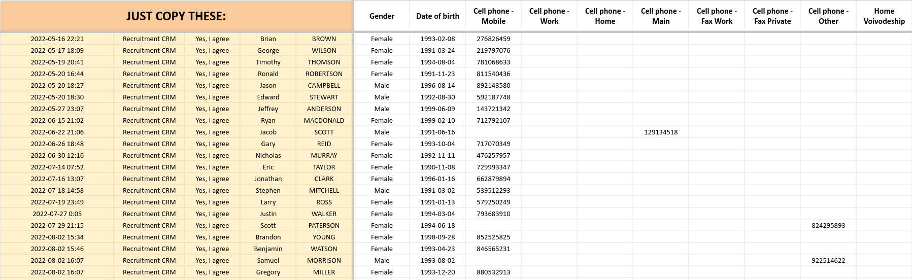
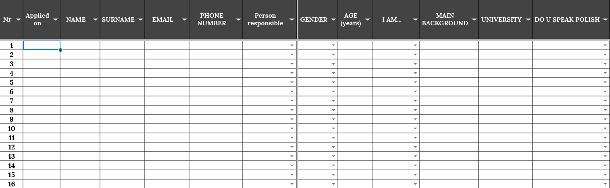
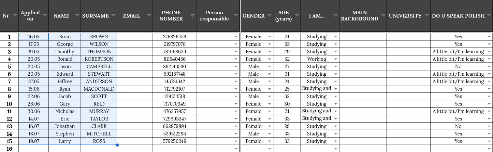
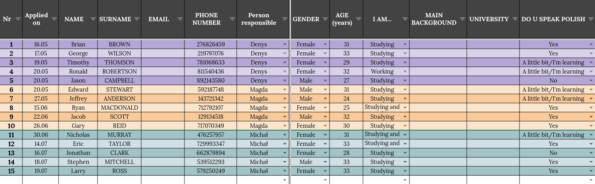
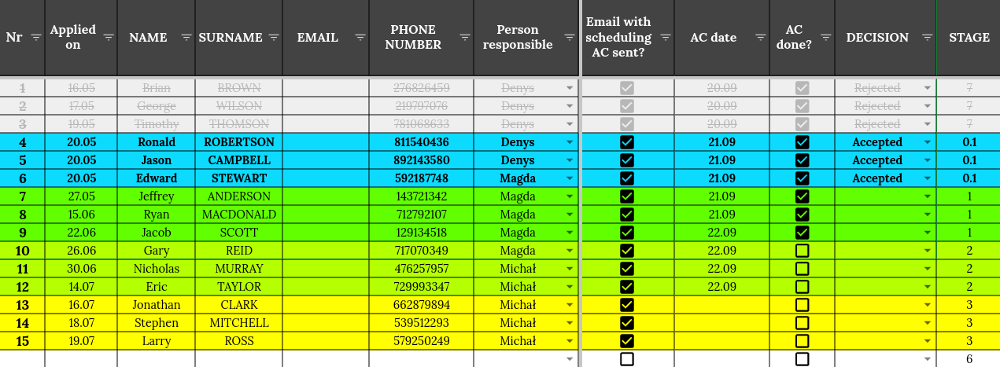
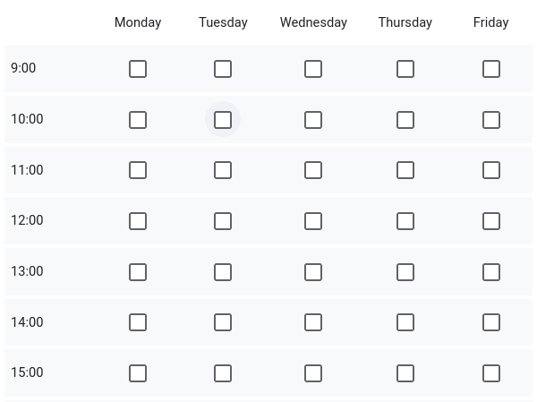
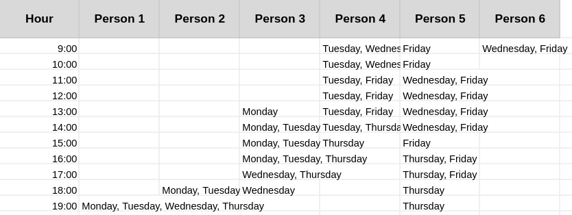
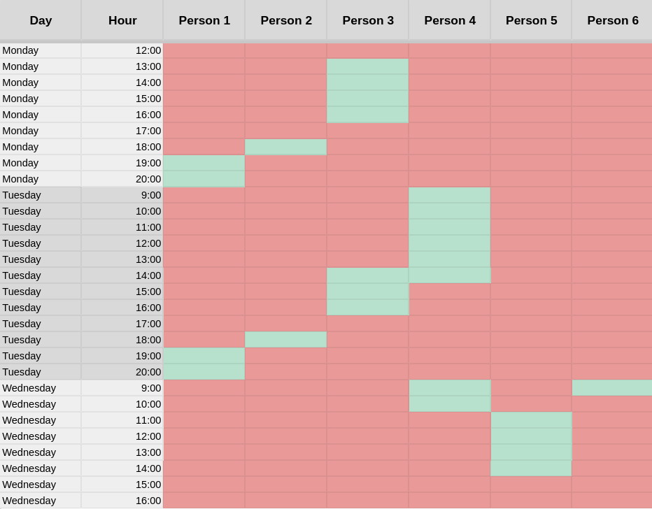

# Recruitment Management Spreadsheet
A spreadsheet created for effective management of the candidates' data &amp; their stages throughout the recruitment process, with an elegant &amp; colorful look.

## Raw CRM data
When the application process for candidates is managed externally, it might be the case for the gathered data to be delivered to you in a not-very-convenient layout. 
Our data came to us in the following format (a screenshot from the "Raw CRM data" sheet):
 

 
<i>Note: this is just an example data, therefore all names and phone numbers are randomly generated.</i>

The "JUST COPY THESE" caption suggest to copy the columns A-E (without the header) and paste it in another sheet.

## CANDIDATES
After pasting (as "values only") the above-mentioned cells, from a blank sheet:
 

 
we're getting this:
 

 
Thanks to certain formulas (e.g. showing the candidates' age instead of a date of birth, merging all columns with phone numbers, etc.) this format is much more accessible for the recruiters.
  
Next step is to assign a recruiter to each candidate:
 

 
The rows are colored by the name of the person responsible, so that it is easy for the recruiters to find their candidates.
  
Another coloring is made depending on the stage of each candidate:
 

 
so that it's clear what actions should be taken for which people. The data can also be sorted by "STAGE", which will move the rejected candidates to the end.

## Weekly availability
When gathering a weekly time availability of candidates, e.g. via Google Forms, in such format:
 

  
The output looks like this:
 

 
which makes it extremely hard to find a time slot when most people are available.
  
The "Weekly availability" sheet converts this data into a much more accessible form:
 

 
<i> Where: green - available, red - unavailable. </i>
