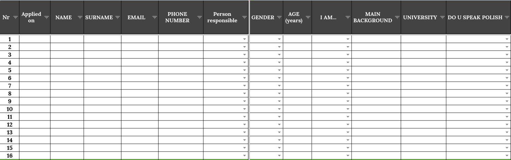
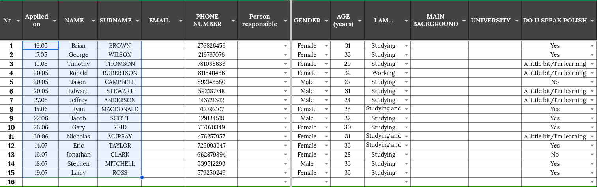

# Recruitment Management Spreadsheet
A spreadsheet created for effective management of the candidates' data &amp; their stages throughout the recruitment process, with an elegant &amp; colorful look.

## Raw CRM data
When the application process for candidates is managed externally, it might be the case for the gathered data to be delivered to you in a not-very-convenient layout. 
Our data came to us in the following format (a screenshot from the "Raw CRM data" sheet):
 

 
<i>Note: this is just an example data, therefore all names and phone numbers are randomly generated.</i>

The "JUST COPY THESE" caption suggest to copy the columns A-E (without the header) and paste it in another sheet.

## CANDIDATES
After pasting (as "values only") the above-mentioned cells, from a blank sheet:
 

 
we're getting this:
 

 
Thanks to certain formulas (e.g. showing the candidates' age instead of a date of birth, merging all columns with phone numbers, etc.) this format is much more accessible for the recruiters.
